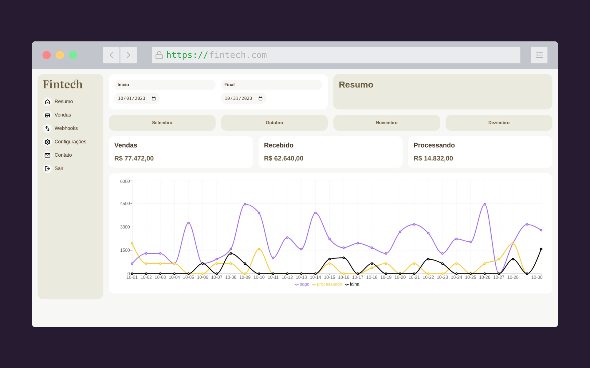

<h1 align="center">
  Fintech - React
    
</h1>

## 💻 Projeto
Nessa aplicação foi desenvolvido para aprimorar toda a base do Framework React (Props, Hooks, ContextApi) e tipagem com Typescript.

## Startando o Projeto

Primeiro, execute o servidor:

```bash
npm run dev
# or
yarn dev
# or
pnpm dev
# or
bun dev
```

Abra [http://localhost:5173](http://localhost:5173) no seu navegador para ver o resultado.

## 👉 TECNOLOGIAS

Este aplicação apresenta algumas das mais recentes ferramentas e práticas em desenvolvimento web!!
Alguns deles estão listados abaixo.

- ⚛️ [ReactJs](https://react.dev/)
- 💹 [Typescript](https://www.typescriptlang.org/)
- 💹 [Recharts](https://recharts.org/en-US/)


## Autor
<a href="#">
 
 <br/>
 <sub><b>Edimilson Braz</b></sub></a>🚀

Feito com ❤️ por Edimilson Braz 👋🏽 Entre em contato!

[](https://www.linkedin.com/in/edimilsonbraz/) 
[](mailto:edimilson.gt8@gmail.com)
